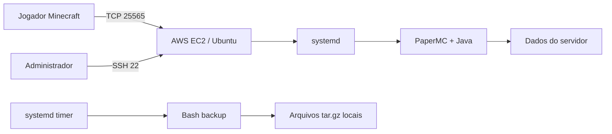

# Minecraft Server Infrastructure on AWS

Projeto de infraestrutura Cloud/DevOps para provisionamento e operação de um servidor Minecraft Java com PaperMC em uma instância Amazon EC2, aplicando administração Linux, gerenciamento de serviços, segurança e automação de backups.

## Configuração

| Item | Configuração |
|---|---|
| Sistema | Ubuntu 26.04 |
| Java | OpenJDK 25 |
| Minecraft | 26.2 |
| Servidor | PaperMC |
| Porta | TCP 25565 |
| Memória JVM | 2–6 GiB |
| Gamemode | Survival |
| Dificuldade | Normal |
| Autenticação | Online mode |
| Controle de acesso | Whitelist |
| RCON | Desabilitado |
| Query | Desabilitado |

## Objetivo

Demonstrar uma implantação simples e operável de um serviço Java persistente: acesso administrativo por SSH, execução com usuário dedicado, gerenciamento por systemd e backup diário automatizado em Bash.

## Arquitetura

## Tecnologias realmente utilizadas

- AWS EC2
- Ubuntu 26.04
- SSH
- Java OpenJDK 25
- PaperMC 26.2 build 121
- systemd
- Bash e `tar`

## Implementação confirmada

- Serviço `minecraft.service` habilitado e em execução.
- Paper executado pelo usuário dedicado `minecraft` em `/opt/minecraft/server`.
- Heap Java configurado com `-Xms2G` e `-Xmx6G`.
- Listener TCP em `*:25565`.
- Backup diário por `minecraft-backup.timer`, às 06:00 UTC.

Consulte [AUDIT.md](AUDIT.md) para os valores confirmados e [docs/operations.md](docs/operations.md) para operação diária.

## Segurança

O serviço não executa como root, usa `NoNewPrivileges=true`, `PrivateTmp=true` e `UMask=0027`. O modo online e a whitelist estão habilitados; RCON e query estão desativados. Não há chaves, IPs ou dados de jogadores versionados neste repositório.

## Operação e backup

O backup usa uma parada controlada do serviço, cria um arquivo `tar.gz`, retém os sete arquivos mais recentes e reinicia o servidor se ele estava ativo. Os comandos de operação estão em [docs/operations.md](docs/operations.md).

## Troubleshooting

Use os logs do unit systemd e valide o listener local. Consulte [docs/troubleshooting.md](docs/troubleshooting.md).

## Aprendizados

- Separar o usuário de execução do usuário administrativo reduz privilégio desnecessário.
- systemd fornece inicialização no boot, reinício em falha e logs centralizados sem painel adicional.
- Backups consistentes importam mais que apenas copiar arquivos de mundo em uso.
- Documentação sanitizada permite demonstrar a arquitetura sem expor a operação real.

## Roadmap

- Provisionamento com Terraform.
- Métricas e logs com CloudWatch.
- Alertas de custo.
- Teste periódico de restore de backup.
